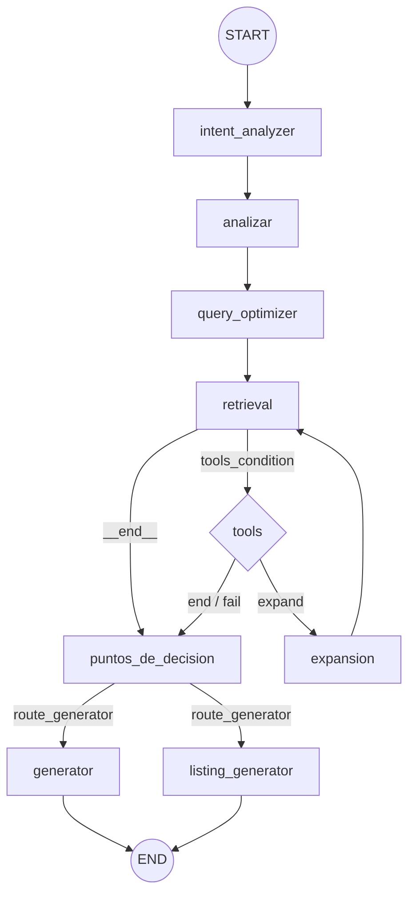

# Bitovi AI Search & RAG Orchestrator


-white)


## 🚀 Overview
An advanced **Autonomous RAG Agent** engineered for Bitovi's technical ecosystem. This system utilizes **LangGraph** to manage complex state transitions, ensuring high-fidelity knowledge retrieval and synthesis from local LLM instances.

<div align="center">
  <a href="https://www.youtube.com/watch?v=eCbAX8MOTao">
    
  </a>
</div>

## 🛠 Tech Stack
*   **Engine**: Python 3.12
*   **LLM**: Llama 3.1 (via Ollama)
*   **Embeddings**: `nomic-embed-text`
*   **Orchestration**: LangGraph & LangChain
*   **State Management**: Pydantic-validated `AgentState`

## 🧠 Graph Architecture
The agent follows a sophisticated conditional workflow to ensure quality:

1.  **Intent Analyzer**: Categorizes query intent.
2.  **Select Retrieval Strategy Analyzer**: Set the best retrieval strategy for the requested data set.
3.  **Query Optimizer**: Resolves acronyms (e.g., K8s, RAG) using a custom technical glossary.
4.  **Retrieval Node**: Interacts with the `retrieve_docs` tool.
5.  **Grade Retrieval**: A self-correction layer that triggers the **Expansion Node** if the context relevance score is below threshold ($< 0.6$).
6.  **Dynamic Routing**: A logical gateway routes the state to specialized generators (`Standard Generator` vs. `Listing Generator`) based on the task type.

## 📁 Repository Structure
```text
src/
.
├── agent/                  # Core graph logic
│   ├── graph.py            # Workflow compilation & edges
│   ├── nodes.py            # Node definitions (Optimizer, Analyzer, etc.)
│   ├── routers.py          # Conditional routing logic
│   ├── state.py            # Pydantic AgentState definition
│   └── __init__.py
├── debug_logs/             # RAG evaluation & trace logs
│   └── retrieved_reranked_docs.md
├── juptyer_tests/          # Prototyping & ChromaDB experiments
│   ├── chroma.ipynb
│   └── nuevo.ipynb
├── scripts/                # Data & Tools layer
│   ├── mapping.py          # Glossary & Technical mappings
│   ├── mysql_tools.py      # Database persistence
│   ├── my_tools.py         # Retrieval tools (retrieve_docs)
│   ├── schemas.py          # Pydantic models & structured outputs
│   ├── utils.py            # Helper functions
│   └── __init__.py
├── .env                    # Environment variables (excluded from Git)
├── config.py               # Global configuration
├── main.py                 # Application entry point
└── requirements.txt        # Project dependencies


A continuación se detalla el flujo lógico del sistema construido con LangGraph. El agente analiza la intención, optimiza la búsqueda en la base de vectores y decide dinámicamente si requiere herramientas adicionales o expansión de consultas antes de generar la respuesta final.

### Esquema del Grafo

